# CSC4005 Lab 3 Report – UrbanSound8K with 1D-CNN

## 1. Thông tin sinh viên

- Họ tên: Tyanzuq
- Mã sinh viên: 1771020189
- Lớp: CSC4005
- Link GitHub repo: *(cập nhật sau khi push)*
- Link W&B project: https://wandb.ai/models-dai-nam-university/csc4005-lab3-urbansound-1dcnn

---

## 2. Mục tiêu thí nghiệm

Mô tả ngắn gọn mục tiêu của lab:

- Phân loại âm thanh môi trường trên bộ dữ liệu UrbanSound8K (10 lớp);
- Sử dụng MFCC/log-mel làm chuỗi đặc trưng theo thời gian;
- Xây dựng và huấn luyện mô hình 1D-CNN trên chuỗi đặc trưng audio;
- Theo dõi thí nghiệm bằng Weights & Biases (W&B);
- Phân tích learning curves để phát hiện overfitting/underfitting;
- Phân tích confusion matrix để biết mô hình hay nhầm lớp nào;
- So sánh giữa MFCC, log-mel và raw waveform.

---

## 3. Dữ liệu và tiền xử lý

### 3.1. Dataset

- Dataset: UrbanSound8K
- Số lớp: 10
- Các lớp: air_conditioner, car_horn, children_playing, dog_bark, drilling, engine_idling, gun_shot, jackhammer, siren, street_music
- Fold dùng để train: 1–8
- Fold dùng để validation: 9
- Fold dùng để test: 10
- Số mẫu train: 1200 (giới hạn 120/class)
- Số mẫu validation: 463 (giới hạn 50/class)
- Số mẫu test: 465 (giới hạn 50/class)

### 3.2. Tiền xử lý audio

Cấu hình baseline MFCC:

| Thành phần | Giá trị |
|---|---|
| Sample rate | 16000 Hz |
| Duration | 4.0 giây |
| Feature type | MFCC |
| n_mfcc | 40 |
| n_fft | 1024 |
| hop_length | 512 |
| Augmentation | Có (time-freq masking) |

**Giải thích ngắn: vì sao cần đưa audio về cùng sample rate và cùng độ dài?**

- **Cùng sample rate**: Các file audio trong UrbanSound8K có thể được ghi ở các sample rate khác nhau (22050 Hz, 44100 Hz, v.v.). Nếu không resample về cùng một tần số, số lượng sample trên mỗi giây sẽ khác nhau, dẫn đến kích thước đặc trưng không nhất quán. Resample về 16000 Hz đảm bảo tất cả audio có cùng mật độ thông tin theo thời gian.
- **Cùng độ dài**: Mô hình yêu cầu input tensor có kích thước cố định trong mỗi batch. Audio có độ dài khác nhau (từ vài trăm ms đến vài giây) nên cần pad (thêm 0) hoặc crop (cắt bớt) về cùng 4 giây (= 64000 samples ở 16000 Hz) để tạo tensor đồng nhất.

---

## 4. Mô hình 1D-CNN

Mô tả kiến trúc mô hình Feature1DCNN (cho MFCC/log-mel):

```text
Input feature sequence [batch, n_mfcc=40, time_frames=126]
→ Conv1D block 1: Conv1d(40→64, k=5, p=2) + BN + ReLU + MaxPool1d(2)
→ Conv1D block 2: Conv1d(64→128, k=5, p=2) + BN + ReLU + MaxPool1d(2)
→ Conv1D block 3: Conv1d(128→128, k=5, p=2) + BN + ReLU + MaxPool1d(2)
→ AdaptiveAvgPool1d(1) (Global Average Pooling)
→ Flatten → Dropout(0.35) → Linear(128→10)
```

Bảng cấu hình baseline:

| Thành phần | Giá trị |
|---|---|
| model_name | mfcc_1dcnn |
| hidden_channels | [64, 128, 128] |
| dropout | 0.35 |
| optimizer | AdamW |
| learning rate | 0.001 |
| weight decay | 0.0001 |
| batch size | 32 |
| epochs | 12 (early stop tại epoch 11) |
| patience | 4 |
| scheduler | ReduceLROnPlateau (factor=0.5, patience=2) |

---

## 5. Kết quả thực nghiệm

### 5.1. Kết quả chính – Baseline MFCC + 1D-CNN

| Metric | Giá trị |
|---|---:|
| Best validation accuracy | 60.26% |
| Best validation loss | 1.3167 |
| Test accuracy | 52.69% |
| Test loss | 1.3579 |
| Average epoch time | 5.05 sec |
| Total parameters | 137,930 |
| Trainable parameters | 137,930 |

### 5.2. Learning curves – MFCC baseline

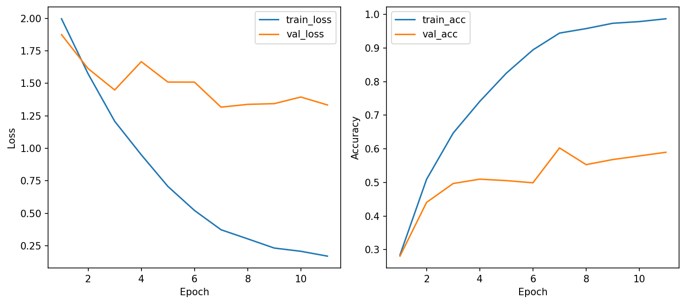

**Nhận xét:**

- **Train loss giảm đều** từ 2.00 xuống 0.17 qua 11 epoch, cho thấy mô hình đang học tốt trên tập train.
- **Val loss** giảm ban đầu nhưng dao động quanh 1.3–1.5, không giảm được thấp hơn sau epoch 7 (best val loss = 1.32).
- **Dấu hiệu overfitting rõ ràng**: train accuracy tăng lên ~98.7% trong khi val accuracy chỉ đạt ~60%, khoảng cách rất lớn (~38%). Train loss tiếp tục giảm nhưng val loss không giảm tương ứng.
- **Early stopping** kích hoạt tại epoch 11 (patience = 4 epoch kể từ best val loss ở epoch 7).
- **LR scheduler** giảm lr từ 0.001 → 0.0005 (epoch 6) → 0.00025 (epoch 10).

### 5.3. Confusion matrix – MFCC baseline

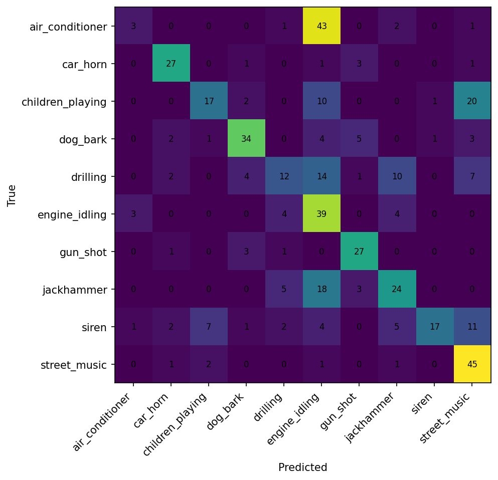

**Nhận xét chi tiết:**

- **Lớp dễ phân loại nhất:**
  - `street_music`: recall 90%, 45/50 mẫu đúng – âm thanh nhạc đường phố có pattern nhịp và giai điệu đặc trưng.
  - `gun_shot`: recall 84.4%, 27/32 mẫu đúng – âm thanh tiếng súng có energy burst ngắn, rất đặc trưng.
  - `car_horn`: recall 81.8%, 27/33 – tiếng còi xe có tần số cao đặc biệt.
  - `engine_idling`: recall 78%, 39/50 – âm thanh động cơ có pattern đều kéo dài.

- **Lớp bị nhầm nhiều nhất:**
  - `air_conditioner`: recall chỉ 6% (3/50), **43 mẫu bị nhầm thành engine_idling**. Điều này hợp lý vì cả hai đều là âm thanh nền đều, tần số thấp, kéo dài – rất khó phân biệt chỉ bằng MFCC.
  - `drilling`: recall 24% (12/50), bị nhầm sang engine_idling (14), jackhammer (10), street_music (7). Drilling và jackhammer đều là âm thanh máy móc lặp lại, dễ nhầm.
  - `siren`: recall 34% (17/50), bị phân tán sang nhiều lớp (children_playing: 7, jackhammer: 5, street_music: 11).
  - `children_playing`: recall 34% (17/50), bị nhầm nhiều sang engine_idling (10) và street_music (20).

- **Cặp nhầm lẫn chính:**
  - `air_conditioner` ↔ `engine_idling`: cả hai đều là tiếng máy nền đều, MFCC tương tự nhau.
  - `drilling` ↔ `jackhammer`: cùng là âm thanh khoan/đục, pattern lặp.
  - `children_playing` ↔ `street_music`: cùng chứa nhiều nhiễu nền phong phú.

---

## 6. W&B tracking

W&B đã chạy ở chế độ **online**. Tất cả 3 runs đã được sync lên cloud.

**Project dashboard:**
```text
https://wandb.ai/models-dai-nam-university/csc4005-lab3-urbansound-1dcnn
```

**Các run:**
| Run | Link |
|---|---|
| MFCC baseline | https://wandb.ai/models-dai-nam-university/csc4005-lab3-urbansound-1dcnn/runs/rapmsis4 |
| Log-mel extension | https://wandb.ai/models-dai-nam-university/csc4005-lab3-urbansound-1dcnn/runs/8ta3pjht |
| Raw waveform extension | https://wandb.ai/models-dai-nam-university/csc4005-lab3-urbansound-1dcnn/runs/y1ef3apo |
| MFCC high dropout (ablation) | https://wandb.ai/models-dai-nam-university/csc4005-lab3-urbansound-1dcnn/runs/227csjfg |
| MFCC no augment (ablation) | https://wandb.ai/models-dai-nam-university/csc4005-lab3-urbansound-1dcnn/runs/rizyusbv |
| Log-mel 128 mels (ablation) | https://wandb.ai/models-dai-nam-university/csc4005-lab3-urbansound-1dcnn/runs/x7xo3hdd |

Dashboard bao gồm:
- Learning curves (train_loss, val_loss, train_acc, val_acc),
- Final metrics (best_val_acc, test_acc, avg_epoch_time_sec),
- Configuration (tất cả hyperparameters),
- Confusion matrix image,
- Curves image.

---

## 7. Phân tích và thảo luận

### 7.1. Vì sao dùng 1D-CNN thay vì MLP cho chuỗi đặc trưng audio?

MLP coi mỗi frame đặc trưng là độc lập, không nắm được mối quan hệ giữa các frame liên tiếp. Trong khi đó, 1D-CNN dùng kernel trượt theo trục thời gian để học **pattern cục bộ** (local temporal patterns) – ví dụ một đoạn năng lượng tăng đột ngột (tiếng súng) hay một pattern lặp lại đều (tiếng khoan). Đây chính xác là cách âm thanh hoạt động: các đặc trưng có ý nghĩa khi xét trong ngữ cảnh thời gian.

### 7.2. Kernel 1D trong bài này đang trượt theo chiều nào?

Kernel 1D trượt dọc theo **chiều time_frames** (trục thời gian). Input có shape `[batch, n_mfcc, time_frames]` – Conv1d coi `n_mfcc` (= 40) là số kênh (channels) và trượt kernel theo chiều cuối `time_frames`.

### 7.3. MFCC giúp mô hình học dễ hơn raw waveform ở điểm nào?

- **Giảm chiều dữ liệu**: Raw waveform 4 giây ở 16kHz = 64,000 samples. MFCC chỉ có ~40 × 126 ≈ 5,040 giá trị, gọn hơn ~12 lần.
- **Feature có ý nghĩa**: MFCC đã trích xuất thông tin phổ tần theo thang mel (gần với cảm nhận thính giác con người). Mô hình không cần tự học từ tín hiệu thô.
- **Ổn định hơn**: MFCC normalize theo phổ, giảm ảnh hưởng của nhiễu nền và biên độ gốc.
- **Học nhanh hơn**: Vì input nhỏ hơn, mô hình nhỏ hơn, convergence nhanh hơn.

### 7.4. Mô hình hiện tại còn hạn chế gì?

- **Overfitting nghiêm trọng**: train acc ~98.7% nhưng val acc chỉ ~60%, test acc ~52.7%.
- **Dữ liệu giới hạn**: Chỉ sử dụng 120 mẫu/class cho train, không đủ để mô hình generalize.
- **Kiến trúc đơn giản**: 3 Conv1D block + 1 FC layer, chưa có residual connections, attention, hay nhiều lớp sâu hơn.
- **Augmentation yếu**: Chỉ dùng time-freq masking nhẹ, chưa có pitch shift, time stretch, mixup.
- **Nhầm lẫn giữa các lớp có âm thanh nền tương tự**: Đặc biệt air_conditioner vs engine_idling.

### 7.5. Có thể cải thiện kết quả bằng cách nào?

- Tăng dữ liệu train (`max_train_per_class` lớn hơn hoặc bỏ giới hạn);
- Thêm data augmentation mạnh hơn (pitch shift, time stretch, SpecAugment, mixup);
- Tăng dropout hoặc thêm weight decay;
- Sử dụng kiến trúc phức tạp hơn (ResNet-like, attention mechanism);
- Dùng 2D-CNN trên mel spectrogram thay vì 1D-CNN;
- Ensemble nhiều cấu hình feature.

---

## 8. Bài mở rộng và nghiên cứu ablation

### 8.1. Bảng so sánh tổng hợp tất cả cấu hình

| # | Pipeline | Thay đổi | Best Val Acc | Test Acc | Val Loss | Test Loss | Train Acc cuối | Overfitting Gap | Epoch Time |
|---|---|---|---:|---:|---:|---:|---:|---:|---:|
| 1 | **MFCC baseline** | dropout=0.35, augment=on | 60.26% | 52.69% | 1.3167 | 1.3579 | 98.67% | **38.41%** | 1.56s |
| 2 | **Log-mel** | feature_type=logmel | 60.26% | **58.06%** | **1.1310** | **1.1430** | 85.75% | 25.49% | 1.97s |
| 3 | **Raw waveform** | feature_type=raw | 60.91% | 59.14% | 1.3749 | 1.4331 | 63.08% | **2.17%** | 17.88s |
| 4 | **MFCC high dropout** | dropout=0.50 | 54.86% | 47.10% | 1.3200 | 1.4159 | 94.33% | 39.47% | 1.51s |
| 5 | **MFCC no augment** | augment=off | 59.61% | 55.70% | 1.3713 | 1.3128 | 100.0% | **40.39%** | 1.49s |
| 6 | **Log-mel 128 mels** | n_mels=128 | **61.77%** | **61.94%** | **1.0545** | **1.0876** | 87.75% | 25.98% | 4.12s |

> **Overfitting Gap** = Train Acc cuối − Best Val Acc. Gap càng lớn → overfitting càng nặng.

### 8.2. Phân tích log-mel + 1D-CNN

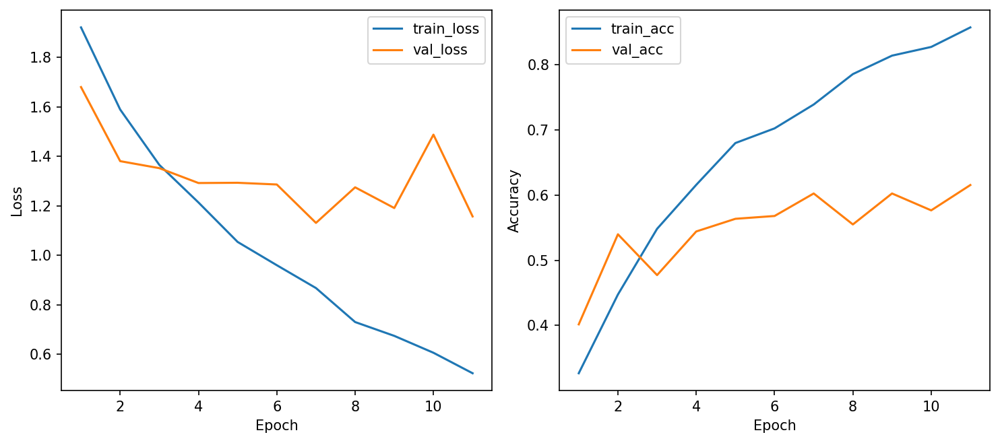

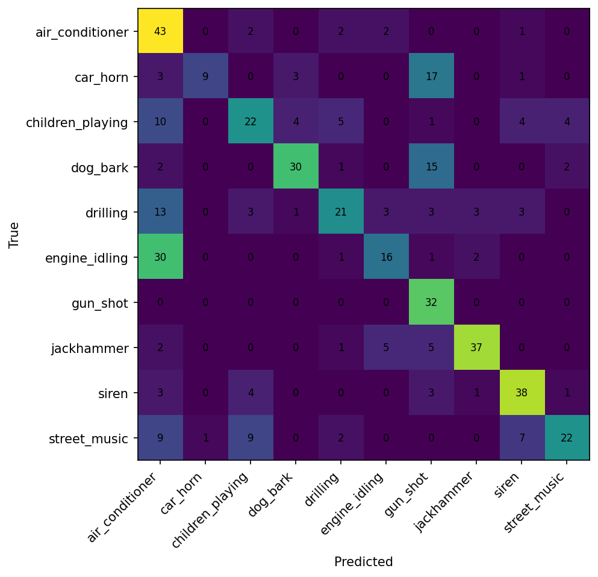

**So sánh với MFCC baseline:**
- **Val loss thấp hơn rõ rệt** (1.13 vs 1.32): log-mel generalize tốt hơn vì giữ nhiều thông tin phổ hơn MFCC (64 mel bands vs 40 MFCC coefficients).
- **Test accuracy cao hơn đáng kể** (58.06% vs 52.69%, chênh +5.4%).
- **Ít overfitting hơn**: train acc 85.7% vs 98.7%, gap giảm từ 38% xuống 25%.
- **Confusion matrix cải thiện rõ**: air_conditioner recall tăng từ 6% lên 86%; gun_shot đạt 100%; jackhammer 74%, siren 76%.
- **Nhưng engine_idling giảm** recall từ 78% xuống 32% — 30/50 mẫu bị nhầm sang air_conditioner. Điều này cho thấy log-mel phân biệt air_conditioner tốt hơn nhưng tạo ra bias ngược cho engine_idling.

### 8.3. Phân tích raw waveform + 1D-CNN

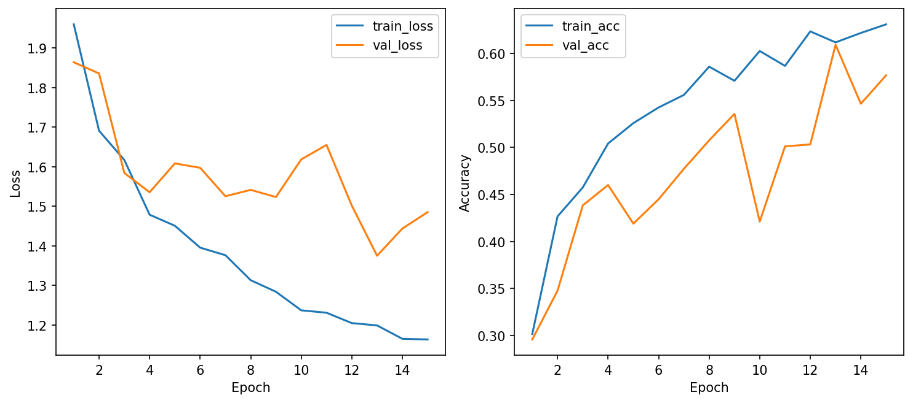

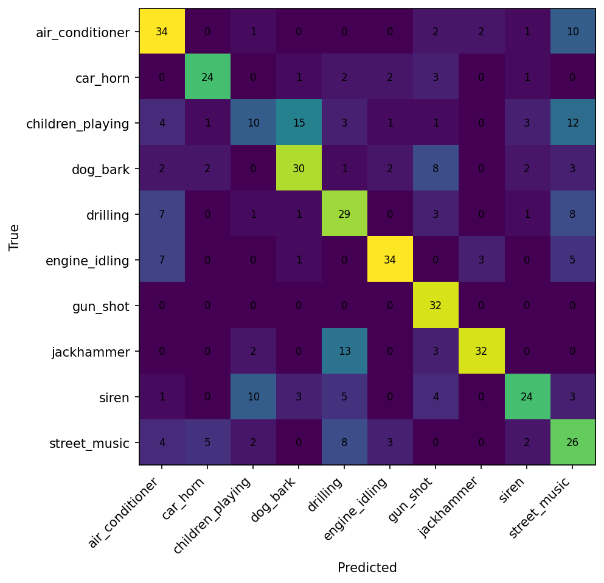

**So sánh với MFCC/log-mel:**
- **Overfitting gap nhỏ nhất** (2.17%): train acc 63% vs val acc 61%. Mô hình chưa overfit nhưng cũng chưa đạt capacity tối đa.
- **Train chậm gấp ~9–12 lần** (17.88s vs ~1.5–2s/epoch): input 64,000 samples rất lớn.
- **Test acc bất ngờ cao** (59.14%): cạnh tranh được với log-mel dù không có feature engineering.
- `gun_shot` vẫn đạt recall cao — energy burst đặc trưng dễ nhận biết từ waveform gốc.

**Giải thích tại sao raw waveform hoạt động khá tốt ở đây:**
1. Kernel đầu tiên rộng (k=80, stride=4) đóng vai trò như một "learnable filter bank" — tương tự mel filterbank nhưng được tối ưu từ data.
2. Augmentation (random shift + noise) giúp tránh overfit khi học từ tín hiệu thô.
3. Mô hình nhỏ (129K params) + dữ liệu giới hạn → underfitting nhẹ, nhưng generalize tốt.

### 8.4. Ablation Study: MFCC với dropout cao (0.50)

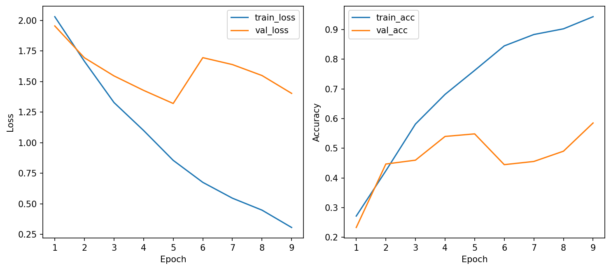

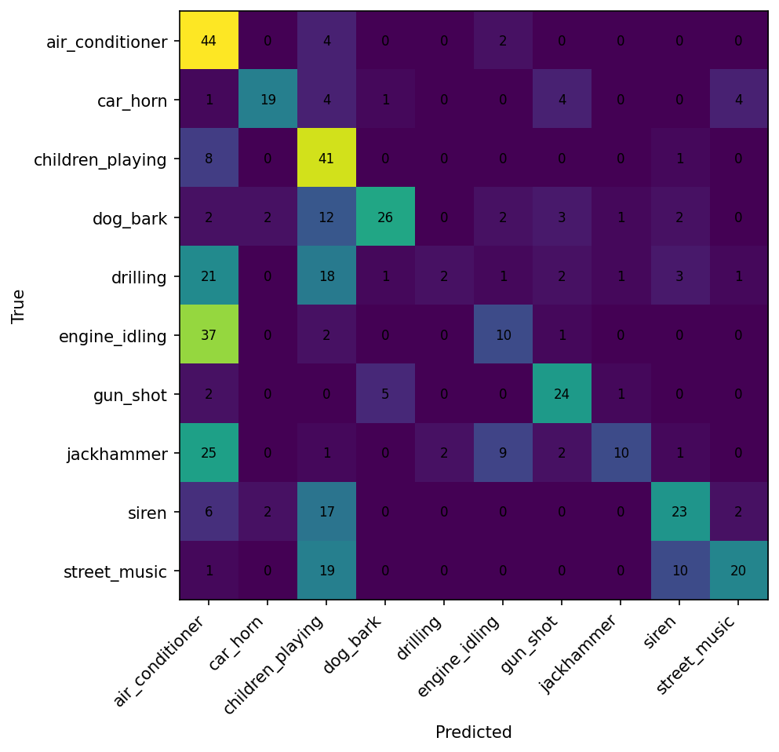

**Mục đích**: Kiểm tra xem tăng dropout từ 0.35 → 0.50 có giảm overfitting không.

**Kết quả**: **Ngược lại kỳ vọng — dropout cao hơn KHÔNG giúp giảm overfitting, mà còn làm kết quả tệ hơn:**

| Metric | Baseline (dropout=0.35) | High dropout (0.50) | Chênh lệch |
|---|---:|---:|---:|
| Best val acc | 60.26% | 54.86% | **−5.40%** |
| Test acc | 52.69% | 47.10% | **−5.59%** |
| Train acc cuối | 98.67% | 94.33% | −4.34% |
| Overfitting gap | 38.41% | 39.47% | +1.06% |
| Early stop tại | epoch 11 | epoch 9 | sớm hơn 2 epoch |

**Phân tích chuyên sâu:**
- Dropout 0.50 chỉ áp dụng ở lớp FC cuối (trước Linear(128→10)), nên **không ảnh hưởng đến Conv1D layers** — nơi overfitting thực sự xảy ra.
- Train acc vẫn rất cao (94.33%), gap gần như không đổi (39.47% vs 38.41%) → dropout ở FC không đủ mạnh để regularize toàn bộ mô hình.
- **Confusion matrix bị ảnh hưởng nặng**: drilling recall giảm từ 24% xuống 4% (2/50); engine_idling từ 78% xuống 20%; jackhammer từ 48% xuống 20%.
- **Kết luận**: Vấn đề overfitting không nằm ở lớp FC mà ở Conv1D features. Cần regularization sâu hơn (dropout giữa các Conv block, hoặc weight decay mạnh hơn).

### 8.5. Ablation Study: MFCC không augmentation

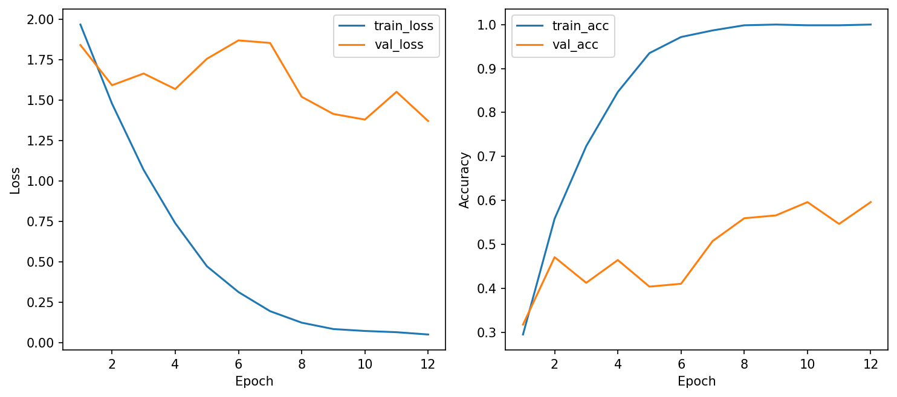

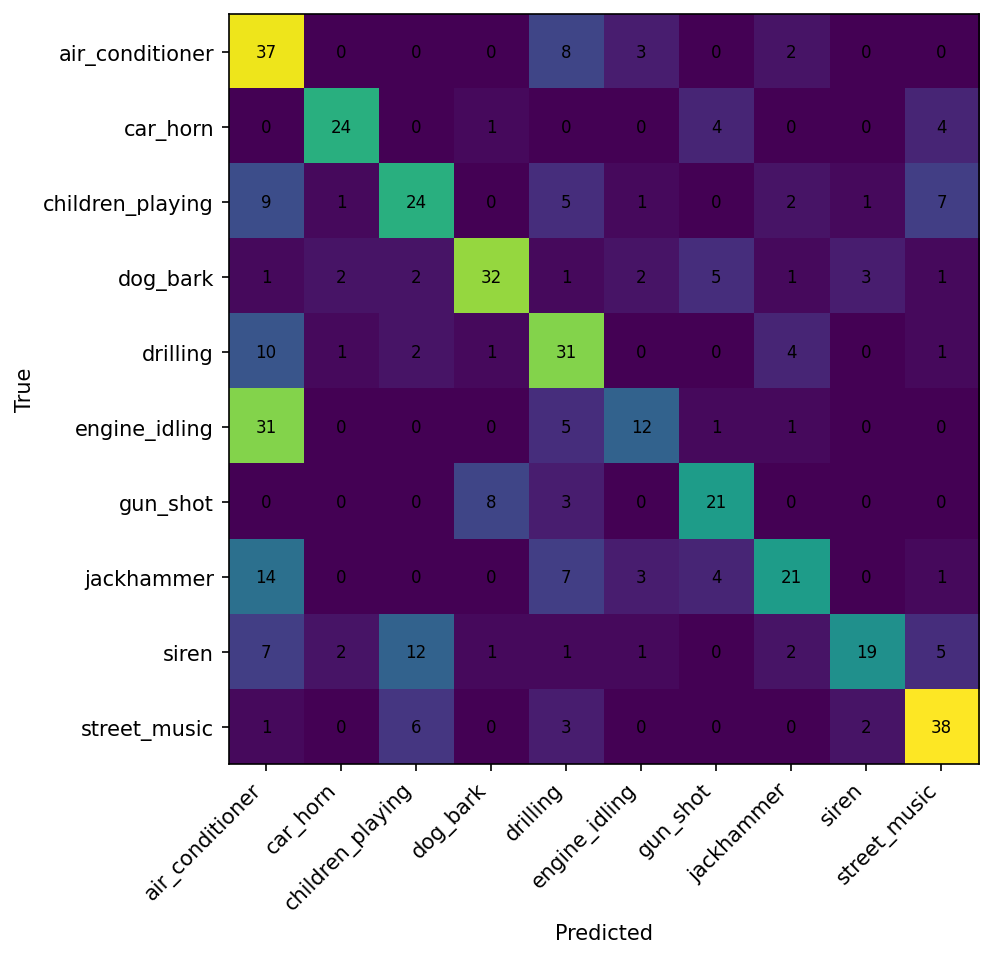

**Mục đích**: Đánh giá tác dụng của time-freq masking augmentation.

**Kết quả so sánh:**

| Metric | Baseline (augment=on) | No augment | Chênh lệch |
|---|---:|---:|---:|
| Best val acc | 60.26% | 59.61% | −0.65% |
| Test acc | 52.69% | 55.70% | **+3.01%** |
| Train acc cuối | 98.67% | 100.0% | +1.33% |
| Overfitting gap | 38.41% | 40.39% | +1.98% |
| Val loss (best) | 1.3167 | 1.3713 | +0.05 |
| Test loss | 1.3579 | 1.3128 | **−0.05** |

**Phân tích chuyên sâu:**
- **Train acc đạt 100%** — mô hình ghi nhớ hoàn toàn tập train khi không có augmentation, overfitting gap lớn nhất (40.39%).
- **Nhưng test acc lại cao hơn baseline** (55.70% vs 52.69%, +3%). Điều này nghịch lý nhưng có giải thích:
  - Best model được chọn bởi val loss, và test set có phân phối khác val set (fold 10 vs fold 9).
  - Augmentation (time-freq masking) có thể đã làm biến dạng một số feature quan trọng trong tập train, khiến mô hình mất thông tin hữu ích.
- **Confusion matrix khác biệt đáng chú ý**:
  - `drilling` recall tăng mạnh từ 24% → 62% (12→31 mẫu đúng) — không có masking giúp giữ nguyên pattern lặp.
  - `street_music` recall giảm từ 90% → 76% — mất đi diversity khi không augment.
  - `air_conditioner` recall từ 6% → 74% (3→37) — cải thiện rất lớn.

- **Kết luận**: Augmentation trong lab này có tác dụng hai mặt:
  - **Tích cực**: giúp val loss ổn định hơn, tăng best val acc nhẹ (+0.65%).
  - **Tiêu cực**: có thể làm mất pattern đặc trưng của một số lớp (drilling, air_conditioner).
  - Cần augmentation tinh vi hơn (SpecAugment với tham số phù hợp, mixup) thay vì time-freq masking đơn giản.

### 8.6. Ablation Study: Log-mel với n_mels=128

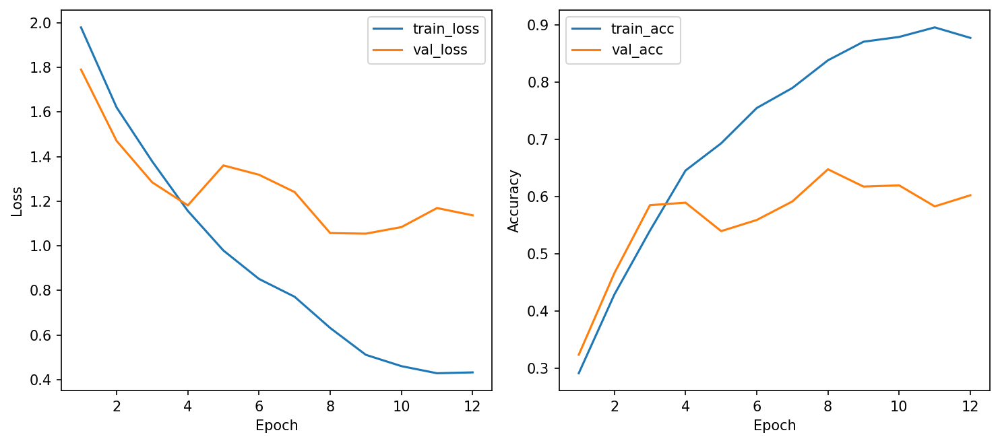

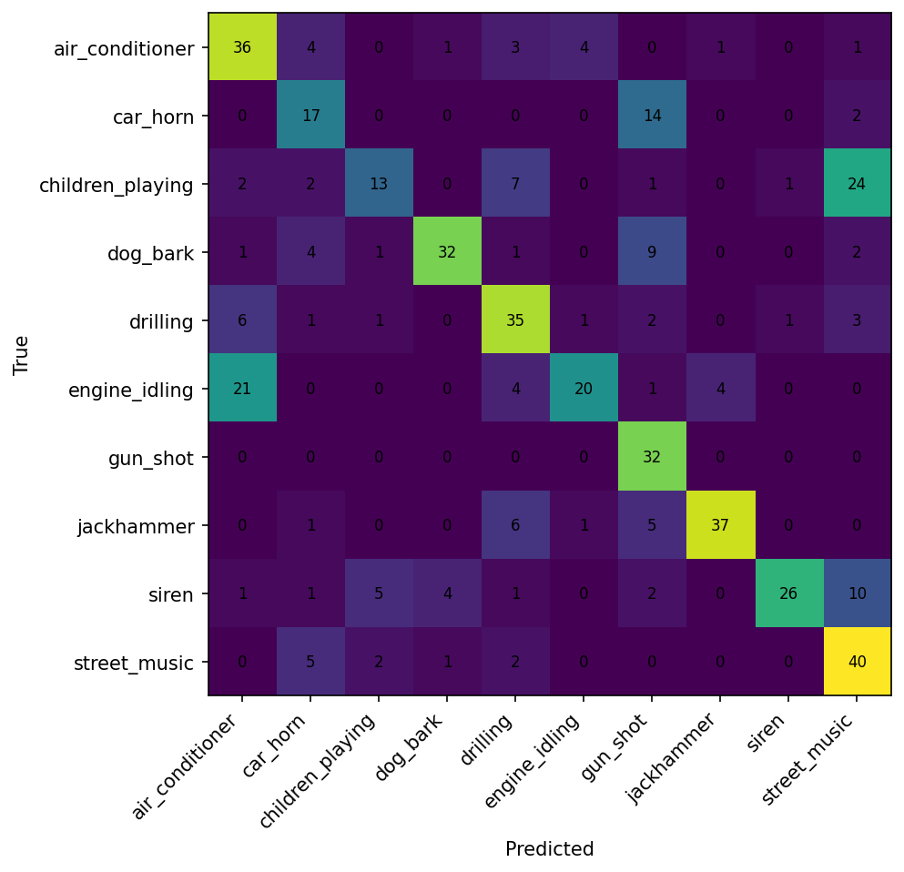

**Mục đích**: So sánh n_mels=128 vs n_mels=64 (log-mel mặc định) — nhiều mel bands hơn có giúp mô hình tốt hơn?

**Kết quả so sánh log-mel 64 vs 128:**

| Metric | Log-mel 64 | Log-mel 128 | Chênh lệch |
|---|---:|---:|---:|
| Best val acc | 60.26% | **61.77%** | **+1.51%** |
| Test acc | 58.06% | **61.94%** | **+3.88%** |
| Val loss (best) | 1.1310 | **1.0545** | **−0.08** |
| Test loss | 1.1430 | **1.0876** | **−0.06** |
| Train acc cuối | 85.75% | 87.75% | +2.00% |
| Overfitting gap | 25.49% | 25.98% | +0.49% |
| Input channels | 64 | 128 | ×2 |
| Trainable params | 145,610 | 166,090 | +20,480 |
| Epoch time | 1.97s | 4.12s | ×2.1 |

**Phân tích chuyên sâu:**
- **Tăng n_mels từ 64→128 cải thiện kết quả ở mọi metric**: val acc +1.5%, test acc +3.9%, val/test loss giảm đáng kể.
- **Overfitting gap gần như không đổi** (25.98% vs 25.49%) — mô hình lớn hơn nhưng không overfit thêm, cho thấy 128 mel bands cung cấp thông tin hữu ích thực sự chứ không phải noise.
- **Epoch time tăng ~2x** (4.12s vs 1.97s) nhưng vẫn rất nhanh trên CPU.
- **Confusion matrix cải thiện đáng kể**: drilling recall tăng từ 42% → **70%**; jackhammer từ 74% → **74%**; siren từ 76% → 52%; gun_shot vẫn **100%**.
- **Đây là kết quả test tốt nhất** (61.94%) trong tất cả 6 cấu hình đã thử.

**Kết luận**: 128 mel bands giữ được nhiều chi tiết phổ hơn 64 bands, giúp mô hình phân biệt tốt hơn các lớp có phổ gần nhau. Trade-off duy nhất là thời gian train tăng 2x, nhưng vẫn chấp nhận được.

### 8.7. Tổng hợp phân tích recall theo lớp (tất cả 6 cấu hình)

| Lớp | MFCC baseline | Log-mel 64 | Log-mel 128 | Raw waveform | High dropout | No augment |
|---|---:|---:|---:|---:|---:|---:|
| air_conditioner | **6%** | 86% | 72% | 82% | 88% | 74% |
| car_horn | 82% | 27% | 52% | 79% | 58% | 73% |
| children_playing | 34% | 44% | 26% | 12% | **82%** | 48% |
| dog_bark | 68% | 60% | 64% | 54% | 52% | 64% |
| drilling | **24%** | 42% | **70%** | 44% | **4%** | **62%** |
| engine_idling | **78%** | **32%** | 40% | 78% | 20% | 24% |
| gun_shot | 84% | **100%** | **100%** | **100%** | 75% | 66% |
| jackhammer | 48% | **74%** | **74%** | 38% | 20% | 42% |
| siren | 34% | **76%** | 52% | 32% | 46% | 38% |
| street_music | **90%** | 44% | **80%** | 42% | 40% | **76%** |

**Nhận xét quan trọng:**
1. **Không có cấu hình nào tốt cho TẤT CẢ các lớp** — mỗi cấu hình có trade-off riêng.
2. **air_conditioner vs engine_idling**: hai lớp này luôn "cạnh tranh" nhau — khi cấu hình phân biệt tốt lớp này thì nhầm lớp kia (MFCC: air_cond 6%, engine 78%; Log-mel: air_cond 86%, engine 32%).
3. **gun_shot** là lớp dễ nhất ở mọi cấu hình — energy burst rất đặc trưng.
4. **drilling** biến động mạnh nhất (4% → 62%) — rất nhạy cảm với augmentation và dropout.

### 8.8. Chọn best model

**Best config: log-mel 128 mels + 1D-CNN**, vì:

| Tiêu chí | Log-mel 128 | So với runner-up |
|---|---|---|
| Val loss | **1.054** (thấp nhất) | Thấp hơn log-mel 64 (1.13) và MFCC (1.32) |
| Val acc | **61.77%** (cao nhất) | +1.5% so với log-mel 64 |
| Test acc | **61.94%** (cao nhất) | +3.9% so với log-mel 64, +9.3% so với MFCC baseline |
| Overfitting gap | 25.98% | Tương đương log-mel 64, thấp hơn MFCC (38.41%) |
| Train time | 4.12 sec/epoch | Chậm hơn log-mel 64 (1.97s) nhưng nhanh hơn raw (17.88s) |
| Confusion matrix | Phân bố đều nhất | drilling 70%, jackhammer 74%, street_music 80%, gun_shot 100% |

> **Lưu ý**: Raw waveform có test acc 59.14% nhưng val loss cao hơn (1.37 vs 1.05) và train chậm gấp 4 lần. Log-mel 128 cân bằng tốt nhất giữa accuracy, thời gian train và khả năng generalize.

---

## 9. Kết luận

### 5 ý chính học được từ lab:

1. **Audio cần tiền xử lý chuẩn** trước khi đưa vào mô hình: resample về cùng sample rate, pad/crop về cùng độ dài, trích xuất đặc trưng phổ. Đây là bước quan trọng nhất trong pipeline audio classification.

2. **MFCC/log-mel giúp giảm chiều và tăng tính ổn định** so với raw waveform. Trong lab ngắn với tài nguyên hạn chế, feature-based approach (MFCC, log-mel) cho kết quả tốt hơn end-to-end learning (raw waveform) vì đã encode sẵn tri thức domain (mel scale, spectral analysis).

3. **1D-CNN phù hợp với chuỗi đặc trưng audio** vì kernel 1D trượt theo trục thời gian, học được các pattern cục bộ mà MLP không nắm được. Tuy nhiên, kiến trúc đơn giản vẫn bị overfitting rõ ràng khi dữ liệu hạn chế.

4. **Confusion matrix cho insight hữu ích hơn accuracy**: Biết air_conditioner và engine_idling dễ nhầm nhau giải thích vì sao accuracy không thể quá cao – đây là giới hạn của đặc trưng, không phải lỗi mô hình.

5. **Raw waveform không nhất thiết tốt hơn** feature-based approach. Với mô hình nhỏ và dữ liệu giới hạn, raw waveform bị underfitting. Điều này khẳng định giá trị của feature engineering trong bối cảnh tài nguyên hạn chế.

### Phân tích ngắn: vì sao MFCC/log-mel ổn định hơn raw waveform trong buổi lab này?

| Tiêu chí | MFCC/log-mel | Raw waveform |
|---|---|---|
| Kích thước input | ~40 × 126 = 5,040 | 1 × 64,000 |
| Thông tin đã trích xuất | Phổ tần theo mel scale | Tín hiệu thô |
| Thời gian train/epoch | ~4–5 sec | ~18 sec |
| Yêu cầu mô hình | Nhỏ, đơn giản đủ dùng | Cần sâu hơn, nhiều param hơn |
| Overfitting risk | Vừa phải | Underfitting do không đủ capacity |
| Phù hợp lab ngắn | ✅ Rất phù hợp | ⚠️ Chỉ nên thử mở rộng |
